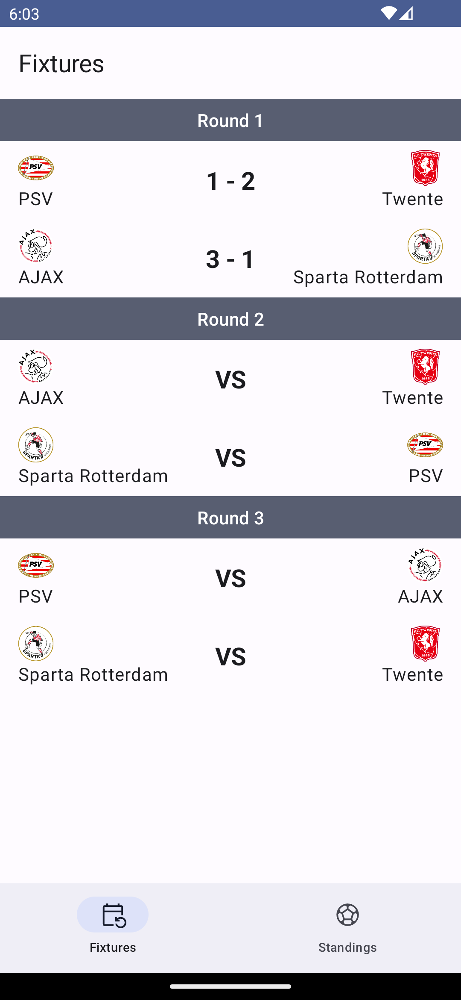
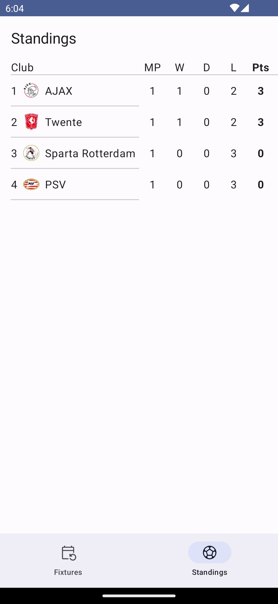
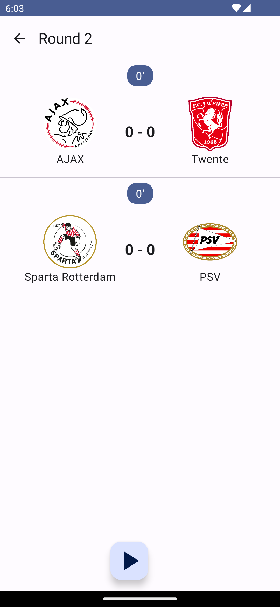

# Mini-Simulator

### App Features.
- List team and create features for 3 rounds, every round has different.
- Show standings of all teams.
- Go to round screen and start game simulation.

Download the 

Check out a demo of the app in action in this 

## Libraries
[Coroutines](https://developer.android.com/kotlin/coroutines)
[Coil](https://coil-kt.github.io/coil/)
[Jetpack Compose](https://developer.android.com/jetpack/compose)
[Koin](https://insert-koin.io/)
[Room](https://developer.android.com/training/data-storage/room)

## Screenshots

  
  
  

